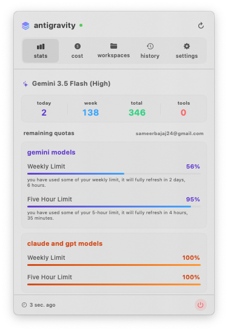
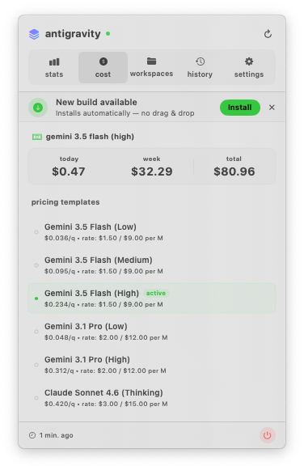
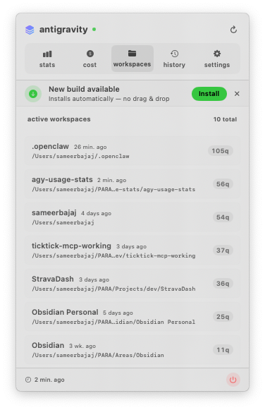
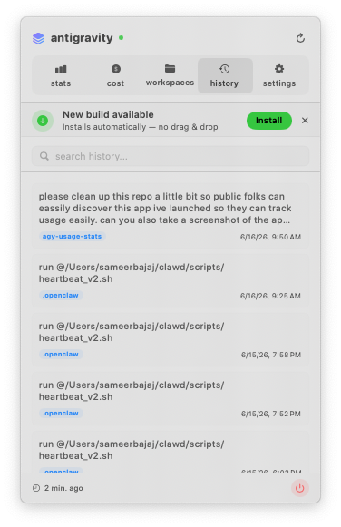
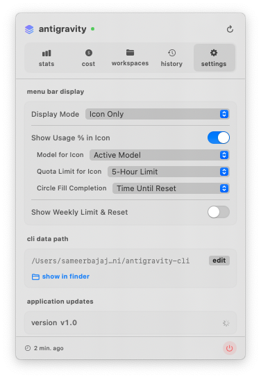

# 🌌 Antigravity Usage Stats

[](https://www.apple.com/macos/)
[](https://developer.apple.com/xcode/swiftui/)
[](LICENSE)

**Antigravity Usage Stats** is a premium macOS menu bar companion application built in SwiftUI. It provides real-time, glanceable monitoring and deep analytics for your local Antigravity CLI (`agy`) usage across all your development workspaces.

With a beautiful, modern interface featuring native macOS design patterns, vibrant HSL gradients, and smooth tab transitions, it helps you track your developer productivity, usage metrics, token quotas, and estimated API costs.

---

## 📸 Interface Preview

````carousel
### 📊 Stats Overview
The main dashboard displays your daily, weekly, and total query counts, active model status, and remaining quota/rate limits with live-updating progress gauges.



<!-- slide -->

### 💵 Cost Tracking
Real-time cost estimations based on standard pricing templates. Tracks your spending patterns and details the rates per million tokens/queries for active models.



<!-- slide -->

### 📁 Workspaces Breakdown
Monitors active projects and directory contexts. Visualizes query distribution per workspace and shows relative time since last activity.



<!-- slide -->

### 🕒 Query History
A searchable, chronological list of all recent queries compiled through the Antigravity CLI, tagged by workspace and timestamp.



<!-- slide -->

### ⚙️ Customize Settings
Toggle menu bar display modes (Icon, Quotas, Queries, or combinations), configure CLI data path directories, and handle automatic application updates.


````

*(On GitHub, see the individual screenshots in the [assets/](assets/) directory.)*

---

## ✨ Key Features

- **🛸 Gravity-Defying Menu Bar Icon**: Features a custom-drawn upward floating chevron logo. As your query count increases, the chevron levitates higher and emits energetic indicator waves underneath it.
- **📊 Real-time Quota Gauges**: Directly monitors your Google Gemini and Anthropic Claude/GPT weekly and 5-hour rate limits, warning you when you are nearing rate limits or when limits will reset.
- **💰 Expense Tracking**: Displays daily, weekly, and lifetime API cost estimates dynamically based on the specific models you use.
- **📂 Workspace Isolation**: Aggregates usage statistics per repository context so you can see which projects consume the most queries.
- **🔍 Searchable Query Logs**: Quickly search through recent prompt history directly from the menu bar popover.
- **🔄 Auto-Refresh File Watcher**: Uses a lightweight file watcher that monitors the `history.jsonl` modification time to trigger seamless, background updates without high CPU usage.
- **⚡ Local Sidecar Integration**: Automatically scans your active local processes to detect the `agy` daemon's listening TCP port, querying localhost APIs directly over HTTPS with self-signed certificate validation.
- **📦 Zero-Setup Self-Updates**: Built-in auto-update engine that downloads and extracts new DMG releases automatically.

---

## 🛠️ How It Works

Antigravity Usage Stats functions as an observer of the local Antigravity CLI environment:

1. **Local Files**: Reads settings from `~/.gemini/antigravity-cli/settings.json` and parses the query log from `~/.gemini/antigravity-cli/history.jsonl`.
2. **Conversation Databases**: Directly queries individual SQLite databases stored under `~/.gemini/antigravity-cli/conversations/*.db` using native C SQLite bindings to aggregate tool call stats.
3. **Localhost Daemon**: Scans `/bin/ps` and `/usr/sbin/lsof` to detect which local port the `agy` language server or CLI process is listening on, then calls its gRPC-JSON gateway endpoints (e.g. `RetrieveUserQuotaSummary` and `GetUserStatus`) to fetch live user tiers and remaining quotas.

---

## 🚀 Installation & Setup

### Requirements
- macOS 15.0 or later
- [Antigravity CLI (`agy`)](https://github.com) installed and configured on your machine

### Getting Started
1. Download the latest release `.dmg` from the [Releases](https://github.com) page.
2. Open the `.dmg` and drag `agy-usage-stats.app` into your **Applications** folder.
3. Launch `agy-usage-stats` from your Applications folder.
4. The custom floating chevron icon will appear in your menu bar. Click it to view the dashboard popover.

---

## 🏗️ Development & Build

You can compile and run the project locally using Xcode or the command line.

### Xcode Build
Open `agy-usage-stats.xcodeproj` in Xcode 16.0+ and run the `agy-usage-stats` target.

### Command Line Build
To perform a local debug build via the terminal, execute:
```bash
xcodebuild -project agy-usage-stats.xcodeproj -scheme agy-usage-stats -configuration Debug build
```

### Packaging Releases
To package a release into a compressed, compressed volume DMG containing Finder layouts and icons, use the build script:
```bash
./scripts/build-dmg.sh v1.0.0
```
This will compile the application in `Release` configuration and output the packaged DMG to the `dist/` directory.

### Helper Scripts
The `scripts/` folder contains useful developer utilities:
* `build-dmg.sh` - Standard release packaging script.
* `generate-icon.swift` - Programmatic generator for the application's ICNS file icon.
* `list_windows.swift` - Debug tool that uses CoreGraphics window APIs to find active window IDs and bounds.
* `click_status_item.swift` - Simulation script that simulates a mouse click on the menu bar status item for testing popover behaviors.

---

## 📄 License

This project is licensed under the MIT License. See [LICENSE](LICENSE) for details.
