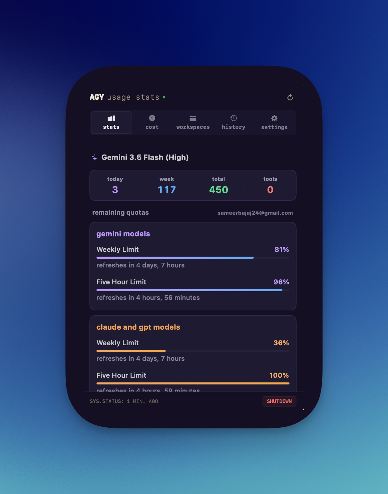

# Antigravity Usage Stats

[](https://www.apple.com/macos/)
[](https://developer.apple.com/xcode/swiftui/)
[](LICENSE)

A macOS menu bar app that tracks your local Antigravity CLI (`agy`) usage. It shows queries, token quotas, and estimated API costs in a simple status-bar dashboard.

<p align="center">
  
</p>

---

## Features

- **Status bar icon**: A chevron logo that updates based on your recent query volume.
- **Quota tracking**: Monitors weekly and short-term rate limits for Google Gemini and Anthropic Claude/GPT, and shows reset times.
- **Cost estimation**: Calculates daily, weekly, and lifetime API spending based on the models you run.
- **Repository stats**: Groups usage by project directory to highlight which workspace is consuming the most tokens.
- **Query search**: Lets you search your recent prompt history directly from the popover.
- **Background updates**: Uses a file watcher on `history.jsonl` to keep statistics current without draining CPU.
- **Daemon integration**: Locates the `agy` daemon process port automatically and queries its localhost APIs.
- **Auto-updater**: Downloads and unpacks new DMG releases when available.

---

## How it works

The app compiles statistics by checking three local sources:

1. **Log files**: Parses settings from `~/.gemini/antigravity-cli/settings.json` and query logs from `~/.gemini/antigravity-cli/history.jsonl`.
2. **SQLite databases**: Connects to the databases under `~/.gemini/antigravity-cli/conversations/` to summarize tool usage and token counts.
3. **Localhost API**: Checks running processes using `ps` and `lsof` to find the port `agy` is listening on, then calls its local endpoints for real-time tier and quota details.

---

## Installation

### Requirements
- macOS 15.0 or later
- Antigravity CLI (`agy`) installed and configured

### Setup
1. Download the latest `.dmg` from the releases page.
2. Drag `agy-usage-stats.app` into your Applications folder.
3. Launch the app to add the chevron to your menu bar.

---

## Development

You can build and run the project locally with Xcode or through the terminal.

### Xcode
Open `agy-usage-stats.xcodeproj` in Xcode 16.0+ and run the `agy-usage-stats` target.

### Command line
Compile a debug build:
```bash
xcodebuild -project agy-usage-stats.xcodeproj -scheme agy-usage-stats -configuration Debug build
```

### Packaging releases
To build a release DMG:
```bash
./scripts/build-dmg.sh v1.0.0
```

### Helper scripts
The `scripts/` directory contains:
- `build-dmg.sh`: Packages the application.
- `generate-icon.swift`: Generates the ICNS icon.
- `list_windows.swift`: Utility that uses CoreGraphics to locate active window IDs for UI testing.
- `click_status_item.swift`: Simulates status item clicks.

---

## License

This project is licensed under the MIT License. See [LICENSE](LICENSE) for details.
